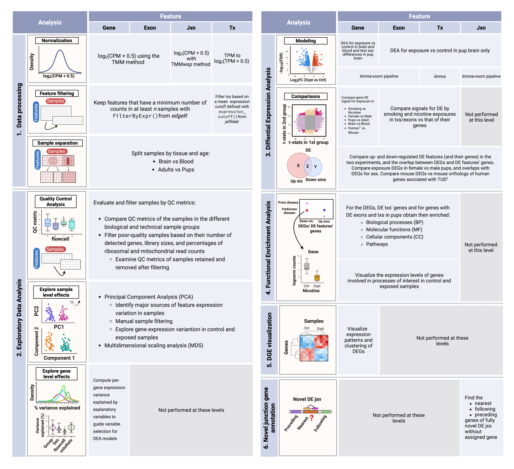

smoking-nicotine-mouse 
======================

[](https://zenodo.org/doi/10.5281/zenodo.10574077)

## Overview

This project consisted of a differential expression analysis involving 4 expression features: genes, exons, transcripts and exon-exon junctions. The main goal of this study was to explore the effects of prenatal smoking and nicotine exposures on the developing brain of mouse pups. As secondary objectives, this work evaluated the affected genes by each substance on adult brain in order to compare pup and adult results, and the effects of smoking exposure on adult blood and brain to search for overlapping biomarkers in both tissues. 

## Study design
 
<p align="center">
  
</p>

**Experimental design of the study.** **A)** 21 pregnant mice and 26 nonpregnant female adults were either administered nicotine (n=12), exposed to cigarette smoke (n=12), or used as controls (n=23; 11 nicotine controls (vehicle) and 12 smoking controls). A total of 137 pups were born to pregnant mice: 19 were born to mice that were administered nicotine, 46 to mice exposed to smoking, and the remaining 72 to control mice (23 to nicotine controls and 49 to smoking controls). Frontal cortex samples of all P0 pups (n=137: 42 of nicotine and 95 of the smoking experiment) and adults (n=47: 23 of nicotine and 24 of the smoking experiment) were obtained, as well as blood samples from the smoking-exposed and smoking control adults (n=24), totaling 208 samples. Number of donors and samples are indicated in the figure. **B)** RNA was extracted from such samples and bulk RNA-seq experiments were performed, obtaining expression counts for genes, exons, transcripts and exon-exon junctions.


## Citation

We hope that this repository will be useful for your research. Please use the following [BibTeX](https://en.wikipedia.org/wiki/BibTeX) information to cite this code repository as well as the data released by this project. Thank you!

> **Modeling the effects of smoking and nicotine exposures on the developing brain**

> Daianna Gonzalez-Padilla, Nicholas J. Eagles, Geo Pertea, Andrew E. Jaffe, Kristen R. Maynard, Keri Martinowich, Leonardo Collado-Torres.

> bioRxiv (TODO DOI); doi: <https://doi.org/10.1101/TODO>

```
@article {TODO (once we have a pre-print)
}
```

## Workflow

<p align="center">
  
</p>

**Summary of analysis steps across gene expression feature levels**: 

* **1. Data processing**: counts of genes, exons, and exon-exon junctions were normalized to CPM and log2-transformed; transcript expression values were only log2-scaled since they were already in TPM. Lowly-expressed features were removed using the indicated functions and samples were separated by tissue and age in order to create subsets of the data for downstream analyses. 

* **2. Exploratory Data Analysis (EDA)**: QC metrics of the samples were examined and used to filter the poor quality ones. Sample level effects were explored through dimensionality reduction methods and segregated samples in PCA plots were removed from the datasets. Gene level effects were evaluated with analyses of variance partition. 

* **3. Differential Expression Analysis (DEA)**: with the relevant variables identified in the previous steps, the DEA was performed at the gene level for nicotine and smoking experiments in adult and pup brain samples, and for smoking in adult blood samples; DEA at the rest of the levels was performed for both exposures in pup brain only. DE signals of the genes in the different conditions, ages, tissues and species (human results from $^1$[Semick et al. 2020](https://www.nature.com/articles/s41380-018-0223-1)) were contrasted, as well as the DE signals of exons and transcripts vs those of their genes. We also analyzed the mean expression of significant and non-significant genes with and without DE features. Then, all resultant DEGs and DE features (and their genes) were compared by direction of regulation (up or down) between and within experiments (nicotine/smoking); mouse DEGs were also compared against human genes associated with TUD from $^2$[Toikumo et al. 2023](https://www.medrxiv.org/content/10.1101/2023.03.27.23287713v2). 

* **4. Functional Enrichment Analysis**: we obtained the GO & KEGG terms significantly enriched in our clusters of DEGs and genes of DE transcripts and exons.

* **5. DGE visualization**: the log2-normalized expression of DEGs was represented in heatmaps in order to distinguish the groups of up and downregulated genes.

* **6. Novel junction gene annotation**: for uncharacterized DE junctions with no annotated gene, their nearest, preceding and following genes were determined. 

<p style="line-height:80%">
<font size="1.5"> 
Abbreviations: Jxn: junction; Tx(s): transcript(s); CPM: counts per million; TPM: transcripts per million; TMM: Trimmed Mean of M-Values; TMMwsp: TMM with singleton pairing; QC: quality control; PC: principal component; DEA: differential expression analysis; DE: differential expression/differentially expressed; FC: fold-change; FDR: false discovery rate; DEGs: differentially expressed genes; TUD: tobacco use disorder; DGE: differential gene expression.
</font>
</p>

See [code](code/) for script summary. 


## Supplementary Tables

See [processed-data/SupplementaryTables](processed-data/SupplementaryTables/) to access and see the description of all supplementary tables generated in this study, including GitHub permalinks to the script lines in which they were created.


## Data access
Original RNA-seq datasets that were used in this analysis are provided through the [_smokingMouse_](https://bioconductor.org/packages/release/data/experiment/html/smokingMouse.html) Bioconductor data package. 

See [raw-data access](raw-data/) section for more details about this package contents and additional information about internal LIBD access. 


## File organization
Files are organized following the structure from [LieberInstitute/template_project](https://github.com/LieberInstitute/template_project). Scripts include the R session information with details about version numbers of the packages we used.

## Internal 
* JHPCE locations:
  * `/dcs05/lieber/marmaypag/smokingMouseGonzalez2023_LIBD001`
  * `/dcl01/lieber/ajaffe/lab/smokingMouse_Indirects` (old location)
